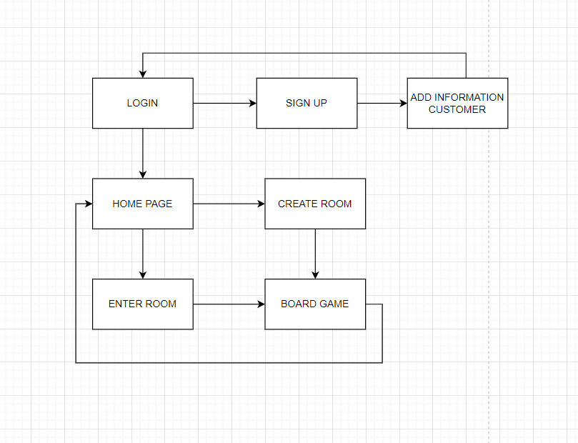
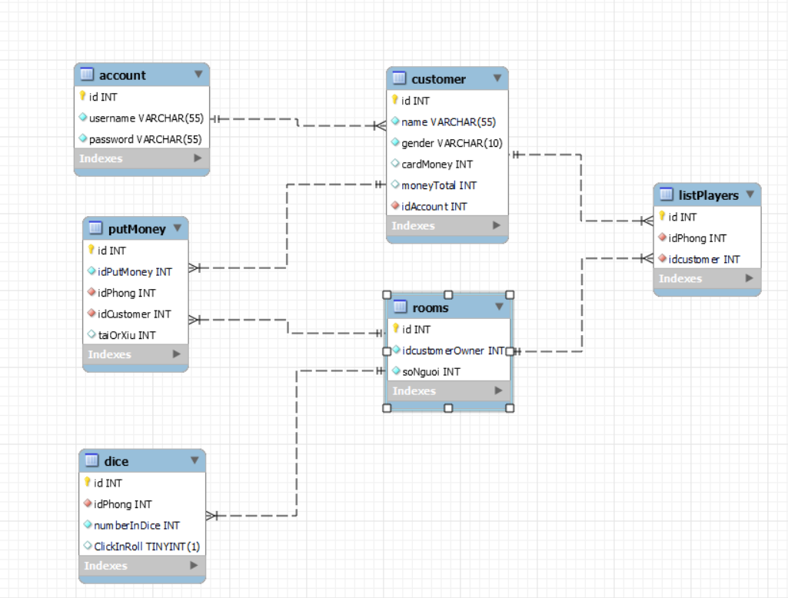

# TRÒ CHƠI TÀI XỈU

## 1. Mô tả bài toán:

- Trò chơi dựa trên 1 viên xí ngầu (hay còn gọi là xúc xắc) – viên xí ngầu có 6 mặt (1, 2, 3, 4, 5, 6). Người chơi sẽ đặt cược kết quả của xí ngầu trước mỗi lần quay.
- Nếu số nút trên mặt xí ngầu từ 1 đến 3 => Kết quả là Xỉu.
- Nếu số nút trên mặt xí ngầu từ 4 đến 6 => Kết quả là Tài .

## 2. Sơ đồ chức năng hệ thống:

## 3. Sơ đồ logic 

## 4. Video

Youtube: https://youtu.be/i829cIF_f38

